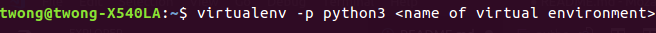

# Mozaic.py

## Description
Created using Numpy and OpenCV, this program can be used to recreate a selected photo (The target) with other images. Was developed using Python 3.5.2.

## Setup
1) Open your terminal, ensure you have Python 3 installed on your computer


2) Download the repo and checkout to the directory of the project

3) Create a virtual environment to isolate the python packages you will be installing


4) Activate the virtual environment and install the packages using the requirements.txt
```bash
source <name of virtualenv>/bin/activate
```
```bash
pip install requirements.txt
```

5) Run the program
```python
python mozaic.py <path to target image> <path to images to use as tiles>
```